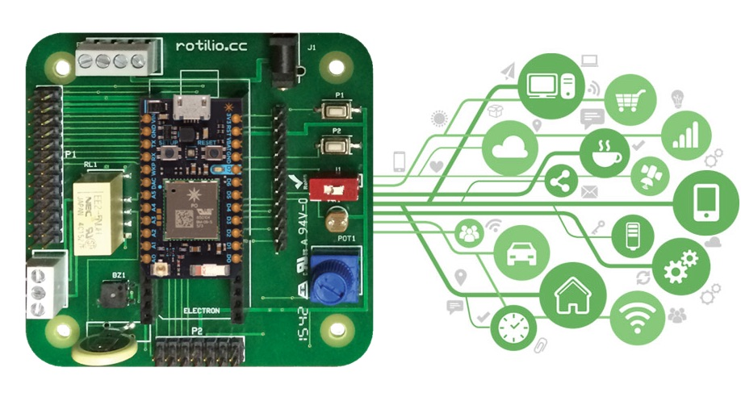
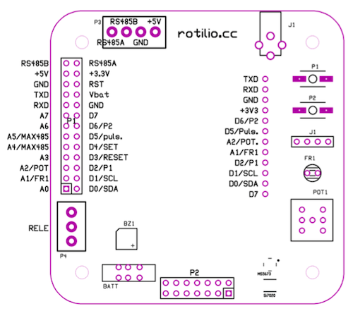

# Rotilio

**Production ready** Internet of Things (IoT) open source hardware and software platform with WiFI and GPRS/3G/LTE connectivity, **Arduino compatible** FreeRTOS [Particle.io](http://particle.io) chip.

Fully loaded with common use **sensors and actuators**.

Multiple communication channels: **WiFI, USB serial, TTL serial, RS485 serial**.

Ready made firmware with Web and Mobile user interface for out-of-the box operation, **no coding** necessary to start, just power on, connect to WiFI and open the Web and Mobile interface to play and control the world.

**Secure** cloud communication for everyday operations and OTA firmware updates.



## Technical datasheet v1.0

### Firmware

```
- Standard Arduino compatible
- FreeRTOS based
- OTA firmware update via cloud
- HTTPs Restful Cloud API
- Automatic application interface configuration
```
Automatic application interface configuration, a technology developed by us for Rotilio, lets you define an interface configuration for every device with different firmware using only one generic user interface.
You don't need to develop a different app for for every different project.

[Digg the code for more](https://github.com/techmakers/rotilio.cc/blob/master/firmware/RotilioSeed.ino)


### User interface
Ready to use, open source Web and Mobile user interface.
You can use our hosted [Web App](https://rotilio.cc) or donwload and customize the [code here](https://github.com/techmakers/rotilio.cc/tree/master/browser).

```
- HTML5+CSS+JS with AngularJS, Twitter Bootstrap, ChartJs
- PhoneGap ready
- User authentication
- Fully customizable
```

### Cloud connectivity
Basically Rotilio can expose variables like temperature, umidity,pressure, light and send events on changes of these and other variables.
Rotilio can receive instructions to switch on the relais, the buzzer, the RGB led and so on.

For standard operation you don't need to manage code, https calls and security but you may want customize Rotilio, so let's make some http restful examples.

(For full documentation about Particle.io Cloud API see [https://docs.particle.io/guide/getting-started/intro/photon/](https://docs.particle.io/guide/getting-started/intro/photon/))

For secuirty sake, to post a cloud API call you need an Access Token like this ```a8e5239db48cdd43165abf879fcd7f43280cd874```. 

You can obtain the access token from the Rotilio user interface, look at the url after login.

##### How to read a variable from a device
the variable name is ```stats```, the device id is ```30001c000647343232363230```.

```
https://api.particle.io/v1/devices/30001c000647343232363230/stats?access_token=a8e5239db48cdd43165abf879fcd7f43280cd874
```

##### How to send a command to a device
the command is ```message```, the message argument is ```setrelais:on```. As you can guess, this is the command to switch on the Rotilio's relais.

```
https://api.particle.io/v1/devices/30001c000647343232363230/message?access_token=a8e5239db48cdd43165abf879fcd7f43280cd874&args=setrelais%3Aon
```

Lets' immagine how much can be simple to write down a web or mobile app to manage the garage door opening in les than an hour.

##### Listen to an event with Eventsource
The big thing is that Rotilio can send events to applications, servers and other cloud services.

```
https://api.spark.io/v1/devices/30001c000647343232363230/events/?access_token=a8e5239db48cdd43165abf879fcd7f43280cd874
```
For example, each time the Rotilio's relais switches to ON, you app can know this receving a message like below.

```
{"data":"relais:1","ttl":"60","published_at":"2016-01-07T22:15:30.482Z","coreid":"30001c000647343232363230"}
```


### Pin out

Rotilio comes to you with the most common sensors and actuators on board.

You may want connect Rotilio to other devices, so here you can find all the connections available.




```
A0 		- Buzzer
A1 		- Photoresistor
A2 		- Trimmer
A3 		- Releais status
A4 		- MAX485 - 
A5 		- MAX485 - 
A6 		- Free
A7 		- Free
D0 		- I2C SDA (on board temperature, umidity, pressure sensors)
D1 		- I2C SCL (on board temperature, umidity, pressure sensors)
D2 		- P1, user button 1
D3 		- RELAIS RESET (bistable only OFF)
D4 		- RELAIS SET (monostable on/off - bistable ON)
D5 		- Switch
D6 		- P2, user button 2
D7 		- Free (on board blue led)
TXD		- SERIAL TTL TX
RXD		- SERIAL TTL RX
RS485A	- RS-485 Serial A
RS485B  - RS-485 Serial B
RST		- Reset
Vbat	- Backup battery (+3 V) for RTC clock in sleep mode
+5V		- +5V power supply
+3.3V	- +3.3V power supply
GND		- Ground
```
Download [Pinout](https://github.com/techmakers/rotilio.cc/raw/master/hardware/ROTILIO_PINOUT.pdf) datasheet in PDF format.

### Input

```
Photoresistor 		- Resolution 12 bit (A1)
Trimmer 			- Resolution 12 bit (A2)
P1 					- Resolution 1 bit (D2)
P2 					- Resolution 1 bit (D6)
Switch 				- Resolution 1 bit (D5)
Temperature1		- Si7020 (I2C - D0&D1) - precision 0.1°C
Umidity 			- Si7020 (I2C - D0&D1) - precision 1%
Temperature2		- MS5673 (I2C - D0&D1) - precision 0.1°C
Pressure/Altitude	- MS5673 (I2C - D0&D1) - precision 1 mbar
```

### Ouput

```
Relais 		- Mono (D4) or bi-stable (D4&D3), simple screw connector,no soldering needed 
Buzzer 		- Resolution 1 bit (A0)
RGB Led 	- Resolution 8 bit/color (Photon), alpha intensity
Blue Led	- Resolution 1 bit (D7)
```

### Communication

```
WiFI		- Broadcom BCM43362, 802.11b/g/n Wi-Fi, open, wep, wpa wpa2, Soft AP Setup, FCC/CE/IC certified
or
CELLULAR 	- GPRS/3G/LTE Global data plan


RS485 		- MAX485 Chip (A4/A5)
SERIAL TTL 	- Serial TTL (RXD - TXD)
I2C			- (D0&D1)
Mini USB B	- RS-232 over USB
```

### CPU & Memory

```
CPU			- STM32F205 120Mhz ARM Cortex M3, Arduino compatible
Memory		- 1MB flash, 128KB RAM, 100 byte flash simulated EEProm
```

### Power supply

```
+5V / +3.3V / Mini USB
Typical power consumption: 
- 160 microA in deep sleep mode (Photon only)
- 450 mA full throttle with CPU+WiFI+Sensors+LED

Using deep sleep mode, Rotilio can be powered by batteries. The on board battery permits to store some variables you need to persists to restore the status of memory and CPU awaking from sleep.
The on board battery is not useful for power supply purpose, so you need to provide an external battery, connected to USB or +5v or +3.3v pins.

```

### Phisical dimensions

```
70x70x20 mm
```

### Support and where to buy Rotilio

You can buy Rotilio, ready to go, here: [Techmakers srl](http://techmakers.io/buy_rotilio.html).

If you need support about Rotilio or want to know more about Rotilio and Techmakers, drop us a line to: [support@techmakers.io](support@techmakers.io)

### About us

Rotilio is proudly crafted and developed in Genova by [Techmakers srl](http://techmakers.io), a startup for Internet connected industrial and consumer products.


## Rotilio from scratch

### Goal

Have a Rotilio working and on-line starting from a brand new Photon. (you don't need to do that if you bought Rotilio with the Photon).

### Steps

1. Extract Photon from it's package and place it on Rotilio
2. Use activation procedure from [Particle.io](https://docs.particle.io/guide/getting-started/start/photon/#step-1-power-on-your-device)
3. Upload Rotilio firmware to your Photon (see above for details)
4. Head on to [https://rotilio.cc](https://rotilio.cc) and log-in with same Particle.io credentials
5. Select your Rotilio and enjoy !!!


#### Upload Rotilio firmware to your Photon (step 3)

1. Clone or download the code [https://github.com/techmakers/rotilio.cc/tree/master/firmware](https://github.com/techmakers/rotilio.cc/tree/master/firmware) on your desktop (or wathever you prefer on your PC)
2. Head on to [https://build.particle.io/build](https://build.particle.io/build) and, if neccessay do login with your Particle.io credentials
3. After interface opens, click "Create new app" button in the "Code" section.
4. Name your App, eg: MyRotilio
5. Be sure to select the right Photon device in the "Devices" section
6. Click on "Flash" (the flash icon) to send the firmware to your Rotilio


### Open source MIT Licence

Copyright (c) 2015 Techmakers srl

Permission is hereby granted, free of charge, to any person obtaining a copy of this software and associated documentation files (the "Software"), to deal in the Software without restriction, including without limitation the rights to use, copy, modify, merge, publish, distribute, sublicense, and/or sell copies of the Software, and to permit persons to whom the Software is furnished to do so, subject to the following conditions:

The above copyright notice and this permission notice shall be included in all copies or substantial portions of the Software.

THE SOFTWARE IS PROVIDED "AS IS", WITHOUT WARRANTY OF ANY KIND, EXPRESS OR IMPLIED, INCLUDING BUT NOT LIMITED TO THE WARRANTIES OF MERCHANTABILITY, FITNESS FOR A PARTICULAR PURPOSE AND NONINFRINGEMENT. IN NO EVENT SHALL THE AUTHORS OR COPYRIGHT HOLDERS BE LIABLE FOR ANY CLAIM, DAMAGES OR OTHER LIABILITY, WHETHER IN AN ACTION OF CONTRACT, TORT OR OTHERWISE, ARISING FROM, OUT OF OR IN CONNECTION WITH THE SOFTWARE OR THE USE OR OTHER DEALINGS IN THE SOFTWARE.
