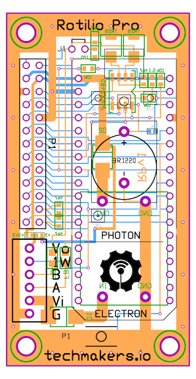

# Rotilio Pro

**Production ready** Internet of Things (IoT) open source hardware and software platform with WiFI and GPRS/3G/LTE connectivity, **Arduino compatible** FreeRTOS [Particle.io](http://particle.io) chip.

Ready to go, for Industrial field applications, with RS-485 connectivity, Modbus.

Multiple communication channels: **WiFI, USB serial, TTL serial, RS485 serial**.

Ready made firmware with Web and Mobile user interface for out-of-the box operation, **no coding** necessary to start, just power on, connect to WiFI and open the Web and Mobile interface to play and control the world.

**Secure** cloud communication for everyday operations and OTA firmware updates.




## Technical datasheet v1.0

### Firmware

```
- Standard Arduino compatible
- FreeRTOS based
- OTA firmware update via cloud
- HTTPs Restful Cloud API
```

Rotilio Pro is the ideal solution to deal with Rs-485 communications. You can use it to play with industrial PLC, using MODBUS protocol for example.

Here you can find a simple example of PLAIN Rs-485 communication between two RS-485 devices.

In this case we connect two Rotilio Pro on the same RS-485 bus just to have an echo of each sent message.

To send a message you have to call the Particle function ```RS485SEND```, to listen for incomin messages you have to subscribe to particle event ```RS485MESSAGE```


### Cloud connectivity

#### Send a RS-485 message

```
https://api.particle.io/v1/devices/30001c000647343232363230/RS485SEND?access_token=a8e5239db48cdd43165abf879fcd7f43280cd874&args=HELLOWORLD
```

#### Subscribing to RS-485 messages

```
https://api.spark.io/v1/devices/30001c000647343232363230/events/RS485MESSAGE?access_token=a8e5239db48cdd43165abf879fcd7f43280cd874
```


### Communication

```
WiFI		- Broadcom BCM43362, 802.11b/g/n Wi-Fi, open, wep, wpa wpa2, Soft AP Setup, FCC/CE/IC certified
or
CELLULAR 	- GPRS/3G/LTE Global data plan


RS485 		- MAX485 Chip (A4/A5)
SERIAL TTL 	- Serial TTL (RXD - TXD)
I2C			- (D0&D1)
Mini USB B	- RS-232 over USB
```

### CPU & Memory

```
CPU			- STM32F205 120Mhz ARM Cortex M3, Arduino compatible
Memory		- 1MB flash, 128KB RAM, 100 byte flash simulated EEProm
```

### Power supply

```
+5V / +3.3V / Mini USB
Typical power consumption: 
- 160 microA in deep sleep mode (Photon only)
- 450 mA full throttle with CPU+WiFI+LED

Using deep sleep mode, Rotilio can be powered by batteries. The on board battery permits to store some variables you need to persists to restore the status of memory and CPU awaking from sleep.
The on board battery is not useful for power supply purpose, so you need to provide an external battery, connected to USB or +5v or +3.3v pins.

```

### Phisical dimensions

```
69x35x20 mm
```

### Support and where to buy Rotilio

You can buy Rotilio PRO, ready to go, here: [Techmakers srl](http://techmakers.io/IoT-products-forMakers.html).

If you need support about Rotilio or want to know more about Rotilio and Techmakers, drop us a line to: [support@techmakers.io](support@techmakers.io)

### About us

Rotilio is proudly crafted and developed in Genova by [Techmakers srl](http://techmakers.io), a startup for Internet connected industrial and consumer products.


## Rotilio from scratch

### Goal

Have a Rotilio working and on-line starting from a brand new Photon. (you don't need to do that if you bought Rotilio with the Photon).

### Steps

1. Extract Photon from it's package and place it on Rotilio
2. Use activation procedure from [Particle.io](https://docs.particle.io/guide/getting-started/start/photon/#step-1-power-on-your-device)
3. Upload Rotilio firmware to your Photon (see above for details)
4. Head on to [https://rotilio.cc](https://rotilio.cc) and log-in with same Particle.io credentials
5. Select your Rotilio and enjoy !!!


#### Upload Rotilio firmware to your Photon (step 3)

1. Clone or download the code [https://github.com/techmakers/rotilio.cc/tree/master/firmware](https://github.com/techmakers/rotilio.cc/tree/master/firmware) on your desktop (or wathever you prefer on your PC)
2. Head on to [https://build.particle.io/build](https://build.particle.io/build) and, if neccessay do login with your Particle.io credentials
3. After interface opens, click "Create new app" button in the "Code" section.
4. Name your App, eg: MyRotilio
5. Be sure to select the right Photon device in the "Devices" section
6. Click on "Flash" (the flash icon) to send the firmware to your Rotilio


### Open source MIT Licence

Copyright (c) 2015 Techmakers srl

Permission is hereby granted, free of charge, to any person obtaining a copy of this software and associated documentation files (the "Software"), to deal in the Software without restriction, including without limitation the rights to use, copy, modify, merge, publish, distribute, sublicense, and/or sell copies of the Software, and to permit persons to whom the Software is furnished to do so, subject to the following conditions:

The above copyright notice and this permission notice shall be included in all copies or substantial portions of the Software.

THE SOFTWARE IS PROVIDED "AS IS", WITHOUT WARRANTY OF ANY KIND, EXPRESS OR IMPLIED, INCLUDING BUT NOT LIMITED TO THE WARRANTIES OF MERCHANTABILITY, FITNESS FOR A PARTICULAR PURPOSE AND NONINFRINGEMENT. IN NO EVENT SHALL THE AUTHORS OR COPYRIGHT HOLDERS BE LIABLE FOR ANY CLAIM, DAMAGES OR OTHER LIABILITY, WHETHER IN AN ACTION OF CONTRACT, TORT OR OTHERWISE, ARISING FROM, OUT OF OR IN CONNECTION WITH THE SOFTWARE OR THE USE OR OTHER DEALINGS IN THE SOFTWARE.
