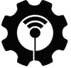
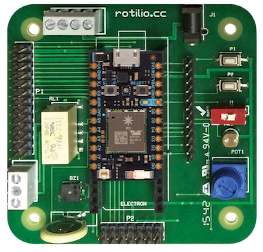

techmakers.io

===================

## La lista della spesa per l'Internet of Things

In questo white paper ragioneremo sulla reale possibilità di costruire soluzioni [IoT](https://it.wikipedia.org/wiki/Internet_delle_cose) funzionanti e sostenibili per utente finale.

Un conto è giocare con un [Arduino](http://arduino.cc) e far accendere una lampada se arriva un tweet.

Tutt'altra cosa è gestire un network di sensori e di attuatori installati in applicazioni sul campo.

Se poi i network da gestire sono qualche migliaio, ecco che il divario tra l'esperimento riuscito con Arduino e una soluzione commerciale sostenibile si amplia ancor di più.

Lo stack tecnologico necessario per creare un ecosistema affidabile e scalabile prevede l'utilizzo di protocolli di comunicazione, server, software di interfaccia, software di manutenzione, firmware, dispositivi, sensori, attuatori.

Se anche solo uno di questi strati dovesse presentare anomalie o debolezze si rischia di vanificare il lavoro di anni o la riuscita di una grande idea innovativa. 

Occorre quindi operare scelte per ogni strato tecnologico con l'idea di poter intervenire a tutti i livelli per poter modificare, scalare, integrare la soluzione con nuove idee ragionando in logica di orizzonte temporale il più lungo possibile.

### Tipica soluzione IoT

La tipica soluzione IoT è quella dove le misure di uno o più sensori connessi ad un dispositivo composto da [MCU](https://it.wikipedia.org/wiki/Microcontrollore) e connessione ad Internet vengono lette da un App mobile. Nell'App mobile sono presenti controlli di interfaccia che permettono di impartire comandi ad un attuatore (Relais o triac di potenza, led, servo).
In alcuni casi, molti, esiste un server che memorizza lo stato del sistema istante per istante e che permette all'App di accedere ad uno storico di letture o allarmi.
Infine l'accesso ai dispositivi viene reso possibile anche mediante sito Web per desktop Pc.

La "lista della spesa" comprende almeno le seguenti voci: sensori, MCU, attuatori, radio Wi-Fi o 3G, connessione internet (ADSL o carrier 3G), server database per dispositivi, server database per utenti, server web, app mobile (almeno Android e iOS).

### Sensori

La scelta in questo caso è guidata dal tipo di applicazione e dalle condizioni fisiche dello scenario.

Sensori "programmabili" possono garantire maggior flessibilità. Una considerazione va fatta anche sulla possibilità o meno di lavorare in modalità stand alone senza quindi dover tenere accesa la MCU.

Un ottimo esempio è il sensore di temperatura DS18B20 della Maxim Integrated che lavora in connessione [1-Wire](https://en.wikipedia.org/wiki/1-Wire) e che può segnalare allarmi per temperature fuori range con consumi estremamente bassi.

La connessione su 1-Wire permette sia di sfruttare un unico pin della MCU per più sensori, sia di posizionare il sensore ad una certa distanza con solo due fili di collegamento.

La scelta dei sensori influisce quindi sulla quantità di sensori installabili, sulla possibilità di posizionarli dove serve e infine sulla durata della batteria del dispositivo IoT.

### Attuatori

L'attuatore viene scelto in base al compito da svolgere, anche qui però ci possono essere interessanti valutazioni da fare come ad esempio la scelta tra un rele monostabile e uno bistabile.

In questo caso la valutazione va fatta incrociando la possibilità di impostare la "posizione" dell'interruttore (Relais) e poi spegnere la MCU (complessità elevata ma risparmio sulla batteria) contro la più semplice modalità ON/OFF del relais monostabile. Il rele bistabile peraltro necessita di due pin contro uno del monostabile.

### MCU

La MCU è il cuore della nostra soluzione IoT.

All'interno della MCU gira il firmware. Lo standard Arduino che mutua il principio del linguaggio Processing fornisce allo sviluppatore del firmware un ambiente confortevole e semplice da gestire, eliminando la necessità di imparare a pilotare correttamente i Pin della MCU e mascherando tutti i "tecnicismi" di basso livello hardware.

Esistono anche MCU programmabili in JavaScript che presenta l'innegabile vantaggio della sua diffusione e della massima flessibilità nella gestione dei dati.

La scelta è ardua, qui la considerazione è quella di valutare più che altro la stabilità di esecuzione e la possibilità di aggiornare facilmente il firmware, anche una volta che la soluzione sia stata installata sul campo.

Sarebbe un vero peccato installare qualche migliaio di dispositivi IoT per poi accorgersi di qualche baco o della possibilità di migliorare il firmware con nuove funzionalità o con modalità di funzionamento a minor impatto energetico.

Un aggiornamento "Over The Air" anche a dispositivi installati è in opzione da non sottovalutare.

#### L'impatto energetico

Questo argomento viene spesso ignorato dai maker alle prime esperienze, ma, prima o poi, inevitabilmente si finisce per doverci fare i conti.

I motivi possono essere diversi, spesso la necessità principale è quella dell'alimentazione a batteria.

Un altro motivo di valutazione dell'impatto energetico potrebbe essere il calore sviluppato dalla [CPU](https://it.wikipedia.org/wiki/CPU) durante l'esecuzione del firmware.

Questo calore deve essere in qualche modo dissipato per evitare di "cuocere" la CPU e anche per non "inquinare" letture dei sensori con temperature troppo alte nel caso si trovassero nelle vicinanze della CPU.

La possibilità di alimentare il dispositivo con una batteria amplia il numero di scenari applicativi possibili, e a volte potrebbe essere determinante per l'adozione della soluzione da parte dell'utente finale.

In questo la scelta della MCU diventa cruciale, vediamo quali sono i modi per abbattere l'impatto energetico della nostra soluzione IoT.

Prima di tutto una MCU che "consuma poco" è la parte più importante. Quindi inutile scegliere una MCU molto veloce se ad esempio i calcoli da fare sono pochi.
Se disponiamo di una connessione verso Internet possiamo delegare molti calcoli al server o all'App stessa, a seconda dei casi.

Molte applicazioni IoT non necessitano di una grande "risoluzione" temporale nell'acquisizione del dato, esempio: la temperatura di un ambiente, non è tanto veloce nelle sue variazioni da richiedere un campionamento continuo, ad ogni ciclo di esecuzione.

In questi casi, se l'applicazione lo consente si può scegliere una MCU che possa assumere diverse modalità di funzionamento, solitamente chiamate "Sleep" e "Deep sleep".

Queste MCU possono memorizzare lo stato delle variabili in una memoria, addormentarsi per risvegliarsi dopo un po' di tempo e richiamare lo stato delle variabili dall memoria.

Il "risveglio" della MCU può essere "a tempo" o sulla variazione di un segnale ad uno dei Pin, per esempio un allarme di temperatura, o alla pressione di un tasto.

Durante la fase "dormiente" la MCU potrebbe consumare anche pochi micro-apere, consentendo quindi il funzionamento a batteria, unitamente ad una minima emissione di calore.

Le MCU programmabili in Javascript attirano molto lo sviluppatore per la bassissima curva di apprendimento. Se questo tipo di MCU interpreta il Javascript prima di eseguirlo, potremmo trovarci un impatto energetico più elevato di quelle che invece fanno girare firmware compilato.

### La radio

Componente fondamentale per connettere il nostro dispositivo a Internet, specialmente se vogliamo posizionarlo liberamente in un ambiente senza tirare cavi Ethernet o seriali.

Lo scenario applicativo può presentare o meno una situazione di connettività Wi-FI. Se non disponiamo della Wi-FI possiamo fare due cose: creare una Wi-FI ad hoc o utilizzare il 3G.

#### Wi-FI

Con una Wi-FI su ADSL a disposizione tutto è più semplice. Il nostro dispositivo può usare tutta la banda che vuole, quando vuole.

La difficoltà in questi casi è rappresentata dalla necessità di impostare le credenziali di accesso alla Wi-FI in fase di setup e dal rendere il nostro dispositivo raggiungibile da Internet quando necessario.

La fase di setup è molto delicata e deve essere il più semplice possibile.

Per questo occorre individuare soluzioni radio che permettano di raggiungere il dispositivo con impostazioni iniziali standard (solitamente si usa una App che "aggancia" il dispositivo e poi invia le credenziali di connessione alla Wi-FI).

Altro aspetto importantissimo è la raggiungibilità dall'esterno.
Questo aspetto viene di solito risolto impostando il router ADSL in modo che indirizzi tutte le richieste che arrivano dall'esterno al nostro dispositivo interno, ma è un operazione che un "non addetto ai lavori" trova estremamente difficoltosa.

Evitare questo passaggio significa semplificare incredibilmente la soluzione IoT e allo stesso tempo renderla anche più affidabile perchè si elimina una dipendenza esterna.

La soluzione sta nell'utilizzo di protocolli di alto livello come [CoAP](https://en.wikipedia.org/wiki/Constrained_Application_Protocol) o [MQTT](https://en.wikipedia.org/wiki/MQTT), appositamente studiati per l'IoT.

L'utilizzo del protocollo [Http](https://it.wikipedia.org/wiki/Hypertext_Transfer_Protocol) così com'è può essere valido in alcune situazioni, ma non sempre risolve completamente il problema.

#### 3G

Il 3G è una grossa opportunità nel momento in cui si voglia essere totalmente indipendenti da connnessioni Wi-FI o altro.

In questo caso la banda disponbile e la velocità potrebbero essere limitate.
Se su Wi-FI il protocollo è importante, su 3G lo è ancor di più.

Occorre inoltre considerare che spesso le soluzioni IoT sono mobili. Quindi ben venga il 3G, ma con una grande limitazione: la nazionalità del carrier utilizzato per la connessione.

Fortunatamente esistono soluzioni di connessione mediante carrier virtuale che permettono di uniformare la questione della connettività su divesi paesi.

I carrier virtuali spesso affiancano lo strato tecnologico con un sistema di management delle SIM finalizzato a semplificare sia l'attivazione che la contabilizzazione dei costi, eliminando così l'incombenza della "ricarica" per l'utente finale.

#### Sicurezza delle trasmissioni

Pensiamo alla sicurezza che abbiamo voluto per le nostre informazioni sensibili trasmesse via Internet come dati personali e numeri di carta di credito.

Se vogliamo pensare alla sicurezza di una applicazione IoT dobbiamo pensare che solo chi effettivamente autorizzato possa acquisire il controllo dei dispositivi, che a volte sono attuatori di macchine o impianti delicati.

I punti di "intromissione" nella comunicazione possono essere, nel caso preso in esame, più di uno: tra dispositivo e server, tra dispositivo e App, tra server e App, tra dispositivi e dispositivi.

Ecco perchè la sicurezza nel mondo dell'IoT deve essere considerata una componente fondamentale di tutto lo stack tecnologico.

Nell'ambito del dispositivo IoT che si connette ad Internet tramite Wi-FI è quindi importante selezionare chip radio che possano gestire comunicazioni criptate, secondo i più moderni standard di sicurezza.

Per quanto riguarda il 3G, la sicurezza del canale è garantita dal sistema UMTS stesso, ma resta sempre il fatto che il dispositivo non debba essere "penetrabile" con attacchi dall'esterno anche semplicemente "pingandolo" con il suo indirizzo IP pubblico. Ecco perchè una rete di dispositivi IoT sicura è costituita da una [VPN](https://it.wikipedia.org/wiki/Virtual_Private_Network) alla quale fanno campo tutte le SIM, tale VPN deve poi essere protetta in modo da permettere l'accesso solo agli utenti autorizzati.

### Server database per dispositivi

Quando si rende necessario tenere traccia di quello che succede, la soluzione più naturale è quella di installare un server che possa memorizzare i dati provenienti dalla rete di sensori e i comandi impartiti dall'interfaccia utente.

Nelle applicazioni IoT però esiste una grandissima differenza rispetto alle applicazioni in cui il sistema è composto da software, interfaccie e utenti che inseriscono e leggono dati.

Infatti nella applicazioni IoT quelli che inseriscono i dati nel database non sono solo gli utenti, anzi, gli utenti ne inseriscono pochi o anche zero.

Il grosso degli inserimenti viene dai dispositivi installati sul campo che leggono i sensori e inviano le variazioni delle letture nel tempo al server.

Ora, se pensiamo ad un applicazione come un social network dove ogni post, invece di essere eseguito "a tempo perso" da un umano, viene eseguito con costante regolarità da un dispositivo, per tutto il giorno, per tutti i mesi e per tutto l'anno, possiamo immaginare l'enorme quantità di dati che si viene a produrre.

Gli esperti di big-data qui gongolano, perchè pensano di essere la soluzione al problema, e invece possono esserlo solo in parte.

Per quanto ne sappiamo oggi, infatti, non esiste la possibilità di memorizzare infiniti dati, quindi, per quanto big possa essere il big-data, non sarà mai infinitamente tanto da farci dimenticare che un limite, da qualche parte, esiste.

Quindi, prima di tutto, occorre ragionare in modo da determinare la giusta quantità di dati che proverranno dalla rete di sensori. Quindi limitare il più possibile il numero di invii alla rete.

Non dimentichiamoci che per quanto limiteremo la quantità di invii, dovremo sempre fare i conti con grosse quantità di dati.

Pensiamo ad un dispositivo che legga tre valori: temperatura, umidità, stato del relais.

Se decidessimo di limitare l'invio ad una frequenza di un invio a minuto, produrremo per ogni dispositivo, in un giorno, 4.320 record, per ogni anno, 1.576.800 record.

Se la nostra applicazione IoT avrà successo, e considereremo come "successo" il numero di 10.000 dispositivi installati, vorrà dire che dovremo trovare un posto dove tenere circa 15 miliardi di record, per ogni anno di vita della nostra applicazione.

Se il record che andremo a memorizzare avrà una forma del tipo:

```
{"device":"30984938742334298742337864983264" "temp": 10.0, "humi": 67, "relais": 0, "time": "2015-06-01T10:10:10Z"}
```

ecco che avremo superato abbondantemente il "Tera" di dati per ogni anno.

A prima vista un terabyte di dati non sembra una cosa pericolosa da maneggiare, ma se pensiamo che questi terabyte devono essere:

1. trasmessi dal device al server
2. inseriti
2. indicizzati
3. backuppati
4. letti

Vuol dire che li abbiamo maneggiati almeno 5 volte, quindi sono 5 terabyte che in qualche modo non solo occupano spazio, ma anche tempo di CPU e banda internet, oltre a spazio disco di backup.

Esistono diversi approcci al problema.

Per prima cosa, oltre a minimizzare il numero di dati gestiti, occorre anche memorizzarli con l'idea che un giorno dovranno essere consultati, per questo si può attivare un metodo di map&reduce creando già le aggregazioni che si prevede saranno utilizzate in lettura, per esempio, organizzando a priori le medie, i minimi e massimi per ora, giorno, settimana, mese, anno.

Infine occorre definire "dove" questi dati dovranno risiedere.

#### Il cloud

Esistono servizi in cloud che permettono di memorizzare serie di dati senza preoccuparsi di installare server o altro.

Alcuni servizi vengono offerti gratuitamente, altri a pagamento.

Quelli gratuiti non offrono garanzie di alcun tipo, esistono "as is", e potrebbero essere dismessi senza preavviso in qualunque momento.

Quelli a pagamento offrono molte garanzie al riguardo, ma in funzione del tipo di applicazione possono risultare troppo onerosi.

Di buono c'è che una volta attivato il servizio e ottenuta la famigerata "Api key", ci si dimentica di tutto e si pensa solo a salvare il dato che ci interessa.

Questi servizi offrono la possibilità di attivare dashboard accattivanti e responsive, a volte anche facilmente integrabili nella nostra App con poco lavoro di coding.

#### Il caro vecchio server nel rack

La soluzione alternativa al cloud può essere un server installato in qualche server farm dove si occupano di alimentarlo e tenerlo connesso alla rete.

Qui occorre però fare i conti con sistema operativo, sicurezza, database server, replicazioni di dati, backup.

Inoltre si pone la necessità di selezionare la tecnologia più indicata per il database engine, per il software di acquisizione delle richieste http, elaborazione e registrazione nel db.

Ultimo dettaglio, di non poca importanza: scrivere il software o trovarne uno già pronto da installare e manutenzionarlo nel tempo.

#### Server appliance "on premise"

Soluzione in totale controtendenza, con i dati che vivono "a casa del cliente".

Pone comunque l'esigenza di installare software da qualche parte, salvare i dati con i backup, dare supporto ai clienti nelle fasi di setup.

Offre però il grande vantaggio di "distribuire il carico".

Infatti i dati sarebbero distribuiti sui diversi server installati presso i clienti interessati ad avere dati storici dettagliati, sezionando così il traffico e il volume, costituendo una sorta di database in "griglia".

Per un entità che volesse poi mantenere la possibilità di aggregare i dati di più clienti al fine di monitorare lo stato di salute generale del sistema, sarebbe comunque possibile selezionare solo una parte dei dati o tenere in memoria solo le ultime settimane a scopo di diagnosi e statistica.

### Server database per utenti

Un applicazione IoT prevede solitamente diversi dispositivi installati, associabili ad uno o più profili utenti.

I numeri in questo caso potrebbero effettivamente non essere così preoccupanti, ma in ogni caso su questo server dovranno autenticarsi le App e i dispositivi, nonchè il sito WEB.

Qui il fattore più importante è l'affidabilità in termini di disponibilità del servizio e di sicurezza.

Dobbiamo infatti garantire all'utente di poter accedere ai suoi dispositivi ogni volta che lo desidera e in totale sicurezza.

E' evidente che qui la soluzione Cloud è vincente, perchè è quella che offre entrambe le cose a costi estremamente contenuti.

Nulla vieta di pensare ad un proprio server installato in server-farm, ma devono esserci i presupposti in termini di numero di utenti e dispositivi installati per poter distribuire i costi di gestione sul maggior numero di utenti.

Potrebbe essere interessante partire con una soluzione in Cloud per poi passare ad un server installato in proprio quando i numeri lo rendono conveniente anche economicamente parlando.

### App Mobile

Qui arriviamo al "piatto forte", quello che fa realmente "gustare" il prodotto al cliente, che gli permette di toccare il suo dispositivo remoto in qualunque situazione.

Dobbiamo prevedere di utilizzare l'App mobile almeno su Android e iOS, e lasciare agli altri utilizzatori di differenti piattaforme la possibilità di accedere via WEB ai propri dispositivi.

Per questo si deve prevedere anche il sito WEB responsive.

Qui siamo nel puro ambito del software e valgono le consuete regole come:

- fornire all'utente la migliore esperienza d'uso
- coprire il maggior numero di dispositivi mobile
- testare l'applicazione in condizioni di scarsa connettività
- verificare l'eventuale utilizzo intensivo di risorse consumatrici di energia come GPS, 3G, Wi-FI

Ma c'è una cosa che va considerata attentamente: se una soluzione IoT prevede differenti dispositivi, con differenti sensori e attuatori, quante interfacce dedicate occorre costruire ?
Inoltre, mettiamo il caso che un dispositivo remoto non sia ancora allineato all'ultima versione di firmware, compatibile con l'ultima versione di applicazione mobile che abbiamo rilasciato.

Come si può semplificare la gestione di differenti dispositivi con differenti release di firmware ?

Le soluzioni possono essere diverse.

Un'ipotesi potrebbe essere quella di mantenere in un applicazione che si aggiorna anche le vecchie versioni di interfaccia, così da mettere a video solo i controlli associati ad una particolare versione di firmware.

Questo però aumenta la complessità del codice dell'App, rischiando di comprometterne la stabilità di esecuzione mano a mano che le versioni si susseguono.

Un'altro approccio potrebbe essere quello di inserire nel firmware del dispositivo anche le istruzioni che l'App potrebbe utilizzare per selezionare i controlli da mostrare all'utente.

Questo prevede l'impostazione di un App che si configura automaticamente quando si connette ad ogni dispositivo.

Se il sistema è valido, potrà succedere che l'App mobile potrà rendere accessibili anche versioni di firmware nate successivamente alla versione corrente dell'App, oppure versioni di firmware personalizzate per singolo utente.

###Conclusioni

Attraverso questo whitepaper abbiamo voluto mettere in evidenza quelle che secondo la nostra esperienza sono le considerazioni e le soluzioni fondamentali per la realizzazione di un prodotto IoT completo, sicuro e facilmente fruibile.

Applicando la soluzioni da noi individuate abbiamo realizzato il nostro primo prodotto IoT [Rotilio](http://techmakers.io/rotilio.html), piattaforma elettronica hardware e software open source che attraverso pochi e semplici passaggi permette la lettura di parametri quali temperatura, umidità, pressione e luminosità.

Inoltre è dotato di un relais bistabile e di un buzzer, oltre che di un led RGB, con i quali può interagire con l'ambiente circostante.

Le sue interfaccie [RS232](https://it.wikipedia.org/wiki/EIA_RS-232), [RS485](https://it.wikipedia.org/wiki/EIA_RS-485), [I2C](https://it.wikipedia.org/wiki/I²C),[1-Wire](https://en.wikipedia.org/wiki/1-Wire) sono ideali per costruire reti di sensori seguendo gli standard più diffusi.

Ogni cosa è accessibile con un morsetto a vite o con PIN di espansione, così da evitare l'utilizzo del saldatore.

Infine, Rotilio porta a bordo Photon, la soluzione WiFi di [Particle.io](http:/particle.io) che comprende MCU e Radio, con canale criptato e procedura di setup delle credenziali Wi-Fi semplificata.

Rotilio è anche predisposto per accogliere Electron di Particle.io, MCU con Radio GSM (2G o 3G) già corredata di SIM con carrier internazionale a tariffa globale unificata.

Rotilio è corredato da un software lato server per registrare gli eventi e le misurazioni dei sensori in un databae in cui i dati vengono analizzati su base temporale.

La [App](http://rotilio.cc/#/home) mobile e WEB dedicata che abbiamo costruito per Rotilio permette la visualizzazione di tutti i parametri di funzionamento e una facile gestione in base alle esigenze di ogni utente.

Il tutto grazie al metodo di configurazione automatica dell'interfaccia in base alle impostazioni ricevute dal dispositivo che si sta interrogando.

Da non dimenticare la perfetta integrazione con il Cloud di Particle.io, che permette quindi di raggiungere tutti i dispositivi Rotilio con semplici chiamate https come ad esempio:

```
http://api.particle.io/v1/devices/0123456789abcdef01234567/temperature
```

->  <-

Se volete saperne di più, visitate il nostro sito web: [techmakers.io](http://techmakers.io)


###Glossario

IoT <https://it.wikipedia.org/wiki/Internet_delle_cose><br>
Arduino <http://arduino.cc><br>
MCU <https://it.wikipedia.org/wiki/Microcontrollore>, <https://en.wikipedia.org/wiki/Microcontroller><br>
I2C <https://it.wikipedia.org/wiki/I²C>, <https://en.wikipedia.org/wiki/I²C><br>
CPU <https://it.wikipedia.org/wiki/CPU>, <https://en.wikipedia.org/wiki/Central_processing_unit><br>
CoAP <https://en.wikipedia.org/wiki/Constrained_Application_Protocol><br>
MQTT <https://en.wikipedia.org/wiki/MQTT><br>
HTTP <https://it.wikipedia.org/wiki/Hypertext_Transfer_Protocol>, <https://en.wikipedia.org/wiki/Hypertext_Transfer_Protocol><br>
VPN <https://it.wikipedia.org/wiki/Virtual_Private_Network>, <https://en.wikipedia.org/wiki/Virtual_private_network><br>
RS232 <https://it.wikipedia.org/wiki/EIA_RS-232><br>
RS485 <https://it.wikipedia.org/wiki/EIA_RS-485><br>
Particle <http://particle.io>


===

-> email: [info@techmakers.io](mailto:info@techmakers.io) tel.: +39010835289 <-

-> copyright (c) 2015 - techmakers srl, via Palestro 45 ar, 16122 Genova (Italia) <-